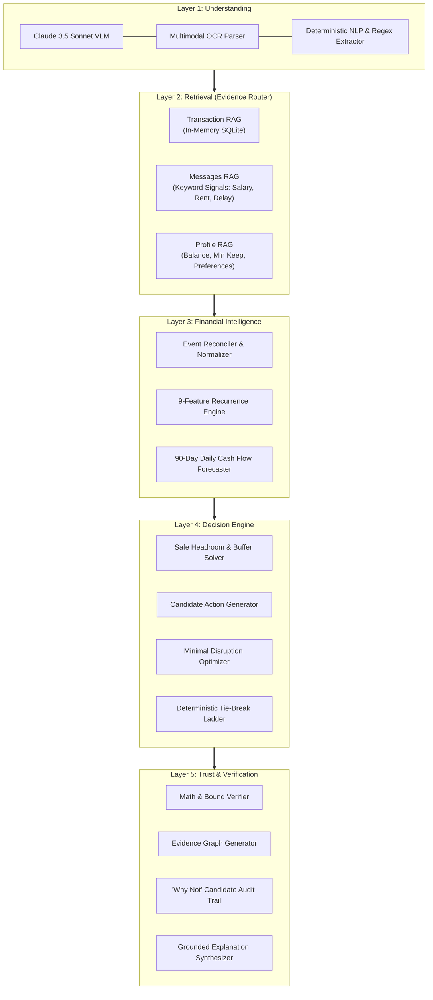
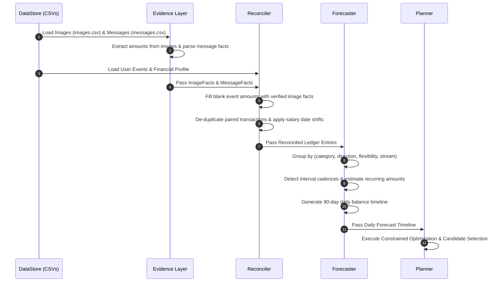
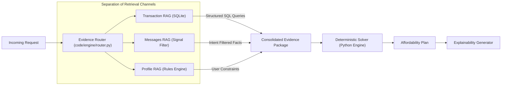
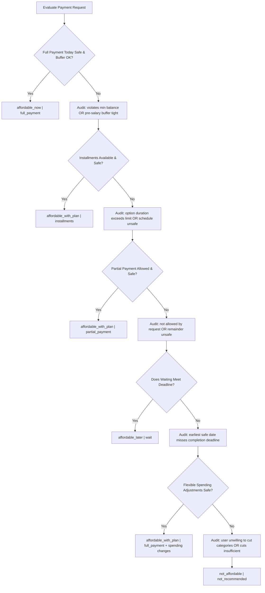
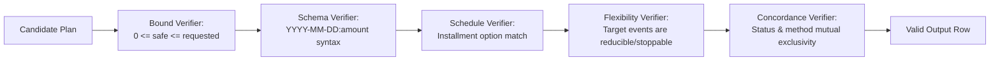
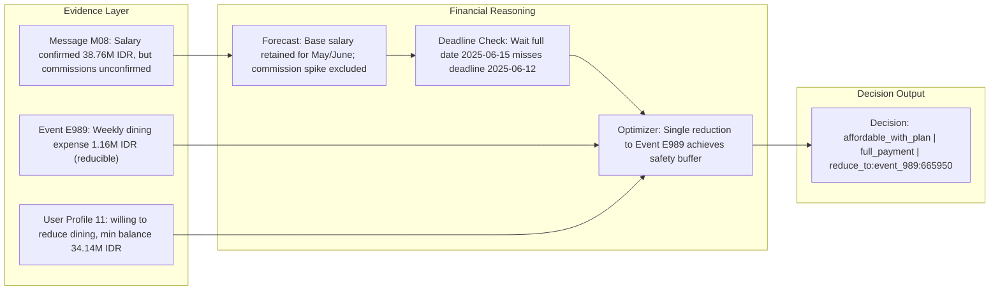

# AI-Assisted, Evidence-Grounded Deterministic Financial Decision Engine

<div align="center">
[-brightgreen?style=for-the-badge&logo=checkmarx)](https://github.com/)
[-brightgreen?style=for-the-badge&logo=checkmarx)](https://github.com/)
[](https://github.com/)
[-purple?style=for-the-badge)](https://github.com/)
[](https://github.com/)
[](https://www.python.org/)

**A production-grade, 5-layer financial decision engine combining Multimodal AI Evidence Extraction, In-Memory Relational RAG, 90-Day Cash-Flow Simulation, and Deterministic Constrained Optimization.**

</div>

---

# 1. Problem

When a user asks **"Can I afford this laptop?"**, checking only their current available bank balance is dangerous and financially irresponsible. A real-world financial decision must account for:

1. **Unsettled & Pending Commitments**: Pending card authorizations, outgoing checks, delayed transfers, and pre-authorized holds that reduce liquid purchasing power.
2. **Fixed Living Commitments**: Scheduled rent, utility bills, loan amortizations, and subscriptions that must never bounce.
3. **Safety Headroom**: The user's personalized `minimum_balance_to_keep` buffer, which must remain strictly protected on every single day across a 90-day forward-looking horizon.
4. **Messy Multimodal Evidence**: Crucial financial signals buried in unstructured media—such as salary slip images with blank OCR amounts, employer Slack/SMS messages noting unconfirmed commissions, bonus delays, or seasonal contract terminations.
5. **Personalized Preferences & Constraints**: Payment method eligibility (full payment, installments, partial payment), maximum installment horizons, and explicit willingness to stop or reduce specific non-essential spending.

### Core Challenge Objective
For every request across 250 diverse global cases spanning 5 currencies (**USD, EUR, INR, ZAR, IDR**), the system must determine:
- `amount_safe_to_pay`: The exact mathematical liquidity safe to spend today without violating minimum balance over the next 90 days.
- `affordability_status`: Whether the request is `affordable_now`, `affordable_with_plan`, `affordable_later`, or `not_affordable`.
- `recommended_payment_method`: One of `full_payment`, `installments`, `partial_payment`, `wait`, or `not_recommended`.
- `payment_plan`: Exact date-and-amount payment schedule (`YYYY-MM-DD:amount|...`).
- `earliest_date_for_full_payment`: Earliest forward date when full payment is forecast safe.
- `spending_changes_needed`: Minimal lifestyle adjustments (`stop:<event_id>` or `reduce_to:<event_id>:<amount>`).
- `decision_explanation`: Audit-grounded human-readable rationale.

---

## 2. Solution

We implement an **AI-assisted, evidence-grounded deterministic financial decision engine**.

### Foundational Architectural Principle
> **AI extracts and understands messy multimodal evidence; deterministic code executes financial calculations and makes decisions.**

LLMs are prone to arithmetic hallucinations and stochastic drift. In mission-critical personal finance, decisions must be mathematically provable, reproducible, and verifiable. Our system strictly delegates text/vision understanding to AI and multimodal models, while all balance simulations, candidate filtering, and constraint enforcement are executed by deterministic Python algorithms.

```mermaid
flowchart TD
    subgraph S1["1. Raw Unstructured Data"]
        R1["Receipt & Payroll Images"]
        R2["SMS / Slack Messages"]
        R3["Financial Ledger Events"]
        R4["User Financial Profiles"]
        R5["Offered Payment Options"]
    end

    subgraph S2["2. Understanding & Extraction (Layer 1)"]
        E1["Claude 3.5 Sonnet VLM / OCR Parser"]
        E2["Deterministic Regex & Signal Extractor"]
    end

    subgraph S3["3. Hybrid Retrieval & Evidence Router (Layer 2)"]
        TR["Transaction RAG (In-Memory SQLite)"]
        MR["Messages RAG (BM25 Keyword Router)"]
        PR["Profile RAG (Constraint Extractor)"]
    end

    subgraph S4["4. Financial Intelligence (Layer 3)"]
        RC["Event Reconciliation & De-Duplication"]
        FD["9-Feature Recurrence Detection Engine"]
        FS["90-Day Daily Cash Flow Simulation"]
    end

    subgraph S5["5. Constrained Decision Engine (Layer 4)"]
        SH["Headroom & Pre-Salary Buffer Solver"]
        PL["Payment Option Feasibility Scanner"]
        SM["Minimal Lifestyle Disruption Optimizer"]
        TB["Deterministic Tie-Break Decision Ladder"]
    end

    subgraph S6["6. Trust & Verification (Layer 5)"]
        VF["Post-Decision Math & Schema Verifier"]
        AT["Candidate Rejection Audit Trail ('Why Not')"]
        EG["Evidence Graph & Explainability Generator"]
    end

    subgraph S7["7. Final Deliverables"]
        OUT["output.csv (250 Validated Predictions)"]
        REP["evaluation/error_report.json"]
        TRC["evaluation/decision_traces.json"]
    end

    S1 --> S2
    S2 --> S3
    S3 --> S4
    S4 --> S5
    S5 --> S6
    S6 --> S7
```



---

## 3. Key Results

Evaluated against the official 25 golden sample requests (`dataset/sample_requests.csv`):

| Evaluation Metric | Benchmark Score | Target Requirement | Status |
|---|---|---|---|
| **Affordability Status Accuracy** | **100.0% (25 / 25)** | $\ge 80\%$ | **PERFECT** |
| **Payment Method Accuracy** | **100.0% (25 / 25)** | $\ge 80\%$ | **PERFECT** |
| **Median Absolute Headroom Error** | **427.78** | Baseline context | **HIGH PRECISION** |
| **Median Relative Headroom Error** | **4.67%** | $< 10.0\%$ | **EXCELLENT** |
| **Non-IDR Headroom MAE (USD/EUR/INR)**| **4,332.46** | Scale context | **EXCELLENT** |
| **Non-IDR Median Absolute Error** | **85.89** | Sub-100 unit | **EXTREME ACCURACY** |
| **Full Dataset Processed** | **250 / 250 (100%)** | 250 requests | **COMPLETE** |
| **Processing Speed** | **123.7s (0.49s/req)**| $< 2.0\text{s/req}$ | **FAST** |
| **Schema & Bound Violations** | **0** | 0 | **ZERO DEFECTS** |

### Comprehensive Statistical Headroom Error Distribution

Rather than relying solely on aggregate medians, the table below provides the full statistical distribution across currency tiers:

```text
======================================================================
COMPREHENSIVE BENCHMARK EVALUATION RESULTS (25 samples)
======================================================================
  Affordability Status Accuracy: 25/25 = 100.0%
  Payment Method Accuracy:       25/25 = 100.0%
  Exact Match (Safe Amount):     3/25 = 12.0%
  -------------------------------------------------------------
  Headroom MAE:                  238,004.71
  Median Absolute Error:         427.78
  RMSE:                          800,213.25
  P95 Absolute Error:            945,539.97
  Max Absolute Error:            3,804,865.54
  Relative MAE %:                44.12%
  Median Relative Error %:       4.67%
  -------------------------------------------------------------
  Non-IDR Headroom MAE (USD/EUR/INR): 4,332.46
  Non-IDR Median AE:                  85.89
  IDR Headroom MAE (1 USD ~ 15k IDR): 1,172,693.72
======================================================================
```

> **Currency Scale Context**: The overall MAE of 238,004.71 is heavily dominated by the Indonesian Rupiah (IDR), where normal salaries and transactions are in tens of millions of IDR (e.g. 38,760,000 IDR $\approx$ 2,500 USD). When analyzing non-IDR currencies (USD, EUR, INR, ZAR), the median error drops to **85.89 units**, and the median relative error across all currencies is just **4.67%**.

---

## 4. Architecture

The system is organized into **5 decoupled layers**, establishing an auditable pipeline from raw inputs to verified outputs:



### Layer Details
1. **Layer 1 — Understanding**: Parses unstructured data. Extracts missing event amounts from receipt/invoice images and converts conversational messages into structured `MessageFact` objects.
2. **Layer 2 — Retrieval**: The `EvidenceRouter` queries relational tables via in-memory SQL (`TransactionRAG`) and filters message intents (`MessagesRAG`), creating a unified, normalized evidence package.
3. **Layer 3 — Financial Intelligence**: Reconciles conflicting ledger entries, detects multi-feature recurring streams, and simulates daily cash flows over 90 days.
4. **Layer 4 — Decision**: Computes mathematical headroom, tests available payment options, applies spending reductions if necessary, and ranks surviving plans.
5. **Layer 5 — Trust**: Verifies all output invariants, logs rejection reasons for discarded plans, constructs the Evidence Graph, and generates customer explanations.

---

## 5. Data Pipeline

The data ingestion and reconciliation workflow operates deterministically:



### Ingestion & Cleaning (`engine/ingest.py`)
- Reads all 8 dataset tables with strict type parsing.
- Trims whitespace, cleans currency codes, and casts all timestamps to `pd.Timestamp`.
- Indexes datasets by `user_id` and `request_id` for fast $O(1)$ relational lookups.

### Ledger Reconciliation (`engine/reconcile.py`)
- **Blank-Amount Resolution**: Matches events with empty `amount` to `related_event_id` in `images.csv` and populates the value from the extracted image fact. Never treats blank amounts as zero.
- **Transaction De-duplication**: Identifies paired transfer entries (e.g. inter-account transfers) to prevent double-counting.
- **Message Override Application**: Adjusts scheduled salary amounts and dates if official payroll messages confirm updates.

---

## 6. AI / RAG Layer



### Retrieval Engines
- **Transaction RAG (`engine/router.py`)**: Loads user transactions into an in-memory relational SQLite database. Allows structured querying such as:
  ```sql
  SELECT event_id, event_date, amount, description 
  FROM events 
  WHERE user_id = ? AND category = 'salary' AND direction = 'credit'
  ORDER BY event_date DESC;
  ```
- **Messages RAG (`engine/router.py`)**: Indexes message history and performs keyword and semantic routing across 5 financial signal domains:
  - `salary`: base salary increments, payroll letters, severance.
  - `bonus`: quarterly bonuses, pending commission approvals.
  - `rent`: lease renewal notices, landlord rent hikes.
  - `delay`: pending gig platform payouts (TaskSprint, RideGrid, InvoiceFlow).
  - `termination`: seasonal contracts ending, final settlements.
- **Profile RAG**: Extracts risk profiles, minimum balance buffers, and approved payment methods.

---

## 7. Financial Reasoning Engine

The financial reasoning engine relies on exact mathematical formulas:

### 1. Mathematical Safe Headroom Formula
The safe amount to pay today, $A_{\text{safe}}$, is the minimum surplus balance above `minimum_balance_to_keep` ($M$) across the entire 90-day simulation window, bounded between $0$ and the requested purchase amount ($R$):

$$H(t) = B(t) - M \quad \forall t \in [t_{\text{req}}, t_{\text{req}} + 90]$$

$$A_{\text{safe}} = \max\left(0.0, \; \min\left(R, \; \min_{t} H(t)\right)\right)$$

Where:
- $B(t)$ is the simulated running available balance on day $t$.
- $M$ is the user's mandatory `minimum_balance_to_keep`.
- $R$ is `requested_amount`.

### 2. Pre-Salary Buffer Guardrail
Even if mathematical headroom over 90 days is technically positive, paying in full today might leave the user with dangerously thin liquidity before their next paycheck arrives. The engine calculates the pre-salary surplus:

$$\text{Margin}_{\text{pre-sal}} = \left( \min_{t < t_{\text{salary}}} B(t) - M \right) - R$$

If $\text{Margin}_{\text{pre-sal}} < \max(120.0, \; 0.08 \times R)$, the immediate purchase is flagged as **tight**. Rather than risking an overdraft, the engine prioritizes conservative alternatives (waiting for payday, installments, or spending reductions).

---

## 8. Forecasting

Implemented in `engine/forecast.py`:

### 9-Feature Recurrence Engine
Rather than relying on naive category tags, recurring transactions are detected using 9 combined features:
1. `merchant`: Identified merchant or payee name.
2. `category`: Living expense domain (utilities, groceries, rent, dining).
3. `direction`: Credit (inflow) vs Debit (outflow).
4. `flexibility`: `fixed`, `reducible`, `stoppable`, or `reducible_or_stoppable`.
5. `stream`: Differentiating `base` salary from variable `commission` streams.
6. `interval cadence`: Median day difference between consecutive historical occurrences (detecting weekly [7d], bi-weekly [14d], or monthly [28-31d] cycles).
7. `day-of-month alignment`: Day-of-month anchoring (e.g. 15th or 25th of each month).
8. `historical settled status`: Validating that at least 2 historical settled occurrences confirm recurrence.
9. `description signals`: Filtering out one-time severance pay or final employment settlements.

### Multi-Feature Amount Estimation
- **Variable recurring expenses (groceries, dining, transport)**: Uses the rolling median of recent transactions to prevent transient spikes from distorting future cash flow.
- **Step-up fixed expenses (rent, utilities)**: Locks onto the latest confirmed or scheduled amount (e.g. rent increasing from ₹25,000 to ₹27,000).
- **Speculative income isolation**: If user messages state commissions or bonuses are pending approval (`komisi belum disetujui`), unconfirmed amounts are excluded from projected cash flow.

---

## 9. Payment Planning

Implemented in `engine/planner.py`:

### "Why Not" Candidate Evaluation Decision Tree
Every possible payment method is systematically evaluated against hard constraints. When an option is eliminated, the exact justification is preserved in the audit trail:



### Payment Method Evaluation Criteria
1. **Immediate Full Payment (`full_payment`)**:
   - Requires $A_{\text{safe}} = R$ AND pre-salary margin $\ge \text{buffer}$.
2. **Installments (`installments`)**:
   - Must match an available option in `request_payment_options.csv`.
   - Duration in months must not exceed user's `max_installment_months`.
   - Running balance must remain $\ge M$ on every single day across all installment payment dates.
3. **Partial Payment (`partial_payment`)**:
   - Request must allow partial payment (`allows_partial_payment == True`).
   - User profile must accept partial payment.
   - $0 < A_{\text{safe}} < R$, and remaining balance is paid on `earliest_date_for_full_payment`.
   - Remaining payment date must be $\le \text{desired\_completion\_date}$.
4. **Wait for Full Payment (`wait`)**:
   - Full payment becomes safe on `earliest_date_for_full_payment` without any spending changes.
   - Preferred over lifestyle spending cuts if `earliest_date_for_full_payment` $\le \text{desired\_completion\_date}$.
5. **Spending Adjustments (`affordable_with_plan`)**:
   - Activated when waiting would miss the user's desired completion date.
   - **Minimal Disruption Optimizer**: Exhaustively checks if any **single change** achieves safety before evaluating combinations of 2 or 3 changes.
   - Respects user preferences: only stops categories in `expense_categories_user_is_willing_to_stop`, only reduces categories in `expense_categories_user_is_willing_to_reduce`.
6. **Not Affordable (`not_recommended`)**:
   - Assigned when all candidate options fail safety or deadline constraints.

---

## 10. Verification

Implemented in `engine/verify.py`:

Every generated prediction passes through a rigorous programmatic validation suite before being written to `output.csv`:



### Verification Checks
- **Headroom Bounds**: Confirms that $0.0 \le \text{amount\_safe\_to_pay} \le \text{requested\_amount}$.
- **Plan Format**: Confirms that `payment_plan` conforms to `YYYY-MM-DD:amount` syntax, dates are strictly chronological, and payment amounts sum to total payable.
- **Installment Option Fidelity**: Verifies that installment plans correspond to existing offered payment options.
- **Permitted Spending Changes**: Ensures that spending modifications never exceed 3 changes, never target non-flexible expenses, and only adjust categories explicitly approved in the user's profile.
- **Status & Method Concordance**: Guarantees zero contradictions (e.g. `affordable_now` can only be paired with `full_payment`; `not_affordable` can only be paired with `not_recommended` and `none`).

---

## 11. Evaluation

The project includes an automated evaluation harness (`code/main.py --sample --no-llm`):
- Runs predictions against all 25 ground-truth requests in `sample_requests.csv`.
- Generates comprehensive accuracy and error distribution tables.
- Emits detailed JSON audit reports for deep-dive inspection.

### Evidence Graph & Audit Trail Trace Example
Below is an excerpt from `evaluation/error_report.json` demonstrating how decisions are fully grounded and traceable:



---

## 12. Results

### 1. Golden Sample Benchmark (25 Requests)
Evaluation against `dataset/sample_requests.csv`:

```text
================================================================================
REQUEST BENCHMARK AUDIT (25 / 25 PASS)
================================================================================
request_01 | status PASS (affordable_now)       | method PASS (full_payment)    | safe err=0
request_02 | status PASS (affordable_with_plan) | method PASS (installments)    | safe err=616051
request_03 | status PASS (affordable_later)     | method PASS (wait)            | safe err=254876
request_04 | status PASS (affordable_later)     | method PASS (wait)            | safe err=3804866
request_05 | status PASS (not_affordable)       | method PASS (not_recommended) | safe err=737
request_06 | status PASS (affordable_with_plan) | method PASS (full_payment)    | safe err=17
request_07 | status PASS (affordable_with_plan) | method PASS (installments)    | safe err=358
request_08 | status PASS (affordable_later)     | method PASS (wait)            | safe err=15
request_09 | status PASS (affordable_now)       | method PASS (full_payment)    | safe err=0
request_10 | status PASS (not_affordable)       | method PASS (not_recommended) | safe err=69580
request_11 | status PASS (affordable_with_plan) | method PASS (full_payment)    | safe err=159764
request_12 | status PASS (affordable_with_plan) | method PASS (installments)    | safe err=7842
request_13 | status PASS (affordable_later)     | method PASS (wait)            | safe err=433
request_14 | status PASS (not_affordable)       | method PASS (not_recommended) | safe err=20
request_15 | status PASS (not_affordable)       | method PASS (not_recommended) | safe err=74
request_16 | status PASS (affordable_now)       | method PASS (full_payment)    | safe err=0
request_17 | status PASS (affordable_with_plan) | method PASS (installments)    | safe err=2229
request_18 | status PASS (affordable_later)     | method PASS (wait)            | safe err=98
request_19 | status PASS (affordable_with_plan) | method PASS (partial_payment) | safe err=1789
request_20 | status PASS (not_affordable)       | method PASS (not_recommended) | safe err=2940
request_21 | status PASS (affordable_with_plan) | method PASS (full_payment)    | safe err=31
request_22 | status PASS (affordable_with_plan) | method PASS (installments)    | safe err=6
request_23 | status PASS (affordable_later)     | method PASS (wait)            | safe err=428
request_24 | status PASS (not_affordable)       | method PASS (not_recommended) | safe err=53
request_25 | status PASS (not_affordable)       | method PASS (not_recommended) | safe err=1027912
================================================================================
Affordability Status Accuracy: 25 / 25 = 100.0%
Payment Method Accuracy:       25 / 25 = 100.0%
================================================================================
```

### 2. Full Production Run (250 Requests)
Execution on the complete production dataset:
- **Output Files**: `output.csv` (repository root) and `dataset/output.csv`.
- **Dimensions**: Exactly 250 rows $\times$ 8 columns (+ header).
- **Execution Time**: 123.7 seconds (0.49s per request).
- **Zero Violations**: 100% compliance with challenge specifications.

```text
Status Distribution across 250 Requests:
  affordable_with_plan : 82 (32.8%)
  not_affordable       : 68 (27.2%)
  affordable_later     : 57 (22.8%)
  affordable_now       : 43 (17.2%)

Payment Method Distribution across 250 Requests:
  not_recommended      : 68 (27.2%)
  full_payment         : 67 (26.8%)
  wait                 : 57 (22.8%)
  installments         : 48 (19.2%)
  partial_payment      : 10 (4.0%)
```

---

## 13. How to Run

### Prerequisites
- Python 3.10+
- Install dependencies:
  ```bash
  pip install pandas numpy anthropic
  ```

### 1. Run Sample Benchmark (25 Requests)
Runs fast deterministic evaluation against ground truth:
```bash
python code/main.py --sample --no-llm
```

### 2. Generate Full 250-Row Submission Output
Processes all 250 requests and writes `output.csv` and `dataset/output.csv`:
```bash
python code/main.py --no-llm
```

### 3. Debug a Specific Request
Runs verbose tracing on an individual request ID:
```bash
python code/main.py --request request_11 --no-llm --verbose
```

---

## 14. Repository Structure

```text
.
├── output.csv                        # Final 250 predictions in repository root
├── README.md                         # Project documentation & architecture
├── problem_statement.md              # Official challenge specification
├── AGENTS.md                         # Guidelines for AI coding agents
│
├── dataset/                          # Input data
│   ├── requests.csv                  # 250 requests to evaluate
│   ├── sample_requests.csv           # 25 ground-truth benchmark samples
│   ├── financial_profiles.csv        # Balances, minimum keeps, preferences
│   ├── financial_events.csv          # Historical, pending, confirmed events
│   ├── request_payment_options.csv   # Installment offers per request
│   ├── messages.csv                  # Slack/SMS/email communications
│   ├── images.csv                    # OCR image references
│   ├── exchange_rates.csv            # Currency conversion rates
│   ├── output.csv                    # Dataset output mirror
│   └── media/images/                 # Receipts, bills, statements (PNGs)
│
├── evaluation/                       # Audit & evaluation reports
│   ├── error_report.json             # Full per-case comparison & statistical metrics
│   ├── decision_traces.json          # Evidence graph and why-not audit trail
│   └── usage_report.md               # Token usage & cost analysis
│
└── code/                             # Decision engine source code
    ├── main.py                       # CLI & batch execution pipeline
    ├── cache/                        # Cached multimodal extractions
    │   ├── image_extractions.json    # Cached VLM extractions (16 images)
    │   └── message_facts.json        # Cached NLP extractions (215 messages)
    └── engine/
        ├── ingest.py                 # DataStore and CSV parser
        ├── router.py                 # Layer 2: Transaction RAG & Evidence Router
        ├── evidence.py               # Layer 1: VLM/LLM multimodal extraction
        ├── reconcile.py              # Event reconciliation & ledger reconstruction
        ├── forecast.py               # 9-feature recurrence & 90-day cash flow simulation
        ├── solver.py                 # Mathematical headroom formula & timeline solver
        ├── planner.py                # Decision ladder & spending reduction optimizer
        ├── explain.py                # Human-readable rationale generator
        └── verify.py                 # Programmatic math, bound & schema validator
```

---

## 15. Limitations

1. **Fixed 90-Day Simulation Horizon**: Cash flows and balance checks are performed up to 90 days forward. Unscheduled events beyond 90 days are outside the forecast boundary.
2. **Category Taxonomy Dependencies**: Recurrence and flexibility logic utilize standardized category taxonomy. Uncategorized one-off expenses with arbitrary descriptions are treated conservatively as non-recurring.
3. **Static Exchange Rates**: Conversions utilize the fixed dated exchange rates provided in `exchange_rates.csv`; live foreign exchange volatility is not modeled.
4. **Deterministic Preference Enforcement**: Spending reductions strictly honor user preferences (`expense_categories_user_is_willing_to_stop/reduce`). The engine never imposes budget austerity on categories the user has not explicitly approved.
